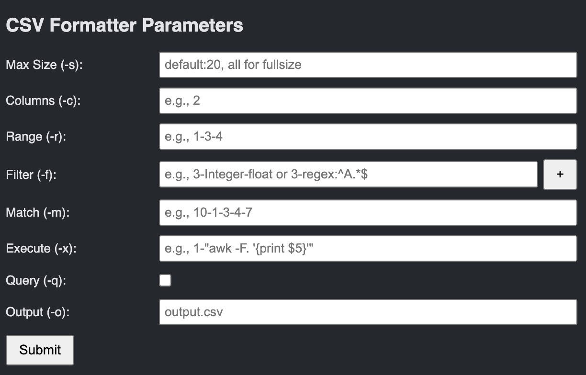

# csvformatter README

csvformatter is an extension which works on CSV files to print them in a table format. It also provides a variety of options to filter the columns.

Usage:
	1.	Open a CSV File:
Open any CSV file in VS Code.
	2.	Trigger the Command:
Open the Command Palette (Ctrl+Shift+P or Cmd+Shift+P) and select CSVFormatter: Format CSV.
	3.	Enter Parameters:
A web view panel will open on the right side of your editor. Fill in the parameters:
	•	Max Size (-s): Maximum character count per column (default is 20; enter all to display full content).
	•	Columns (-c): Specify the number of columns to display (e.g., 2 to display the first two columns).
	•	Range (-r): Enter a list of column numbers separated by hyphens (e.g., 1-3-4).
	•	Filter (-f): Filter rows by specifying a column and its values (e.g., 3-Integer-float).
	•	Execute (-x): Execute a shell command on a column value (e.g., 1-"awk -F. '{print \\$5}'").
	•	Query (-q): Check this box to print the CSV header with column indices and exit.
	•	Output (-o): Enter an output filename to save the formatted CSV (if left blank, the output will be shown in a new editor tab).
	4.	Submit the Form:
Click Submit. The extension will run the Python script with your parameters, and you’ll see the formatted output either in a new tab or saved to the specified file.

## Features

- **CSV Formatting:**  
  Format CSV files into a clean, tabular view using a Python script.
- **Interactive Parameter Input:**  
  Provides an intuitive split-view web form with text boxes and checkboxes to input parameters such as maximum size, columns, range, filter, execute commands, query flag, and output file.
- **Command-Line Options:**  
  Supports various options (-s, -c, -r, -f, -x, -q, -o) to customize the CSV output.
- **User-Friendly Interface:**  
  The web view panel opens split on the right, making it easy to enter options while viewing your CSV file.

> Tip: Consider adding short animations or additional screenshots to showcase your extension in action.

## Requirements

- **Python 3:**  
  Ensure that Python 3 is installed and accessible (i.e., the `python3` command is available in your PATH).
- **Visual Studio Code:**  
  Requires VS Code version 1.x or later.

## Extension Settings

This extension contributes the following settings:

* `csvformatter.enable`: Enable/disable the CSV Formatter extension.
* `csvformatter.someSetting`: (Example setting) Set to `true` to enable additional features.

## Known Issues

- The extension depends on Python 3. If Python 3 is not installed or configured correctly, the extension might not function as expected.
- Improperly formatted CSV files might cause the Python script to return errors.

## Release Notes

### 1.0.0

- Initial release of the CSVFormatter extension.
- Added basic CSV formatting and parameter input via a WebView panel.

### 1.0.1

- Fixed issues with parameter passing.
- Improved UI alignment in the WebView form.

### 1.1.0

- Enhanced support for additional command-line options.
- Improved error handling and logging.

---

## Following extension guidelines

Ensure that you've read through the extension guidelines and follow the best practices for creating your extension.

* [Extension Guidelines](https://code.visualstudio.com/api/references/extension-guidelines)

## Working with Markdown

You can author your README using Visual Studio Code. Here are some useful editor keyboard shortcuts:

* Split the editor (`Cmd+\` on macOS or `Ctrl+\` on Windows and Linux).
* Toggle preview (`Shift+Cmd+V` on macOS or `Shift+Ctrl+V` on Windows and Linux).
* Press `Ctrl+Space` (Windows, Linux, macOS) to see a list of Markdown snippets.

## For more information

* [Visual Studio Code's Markdown Support](http://code.visualstudio.com/docs/languages/markdown)
* [Markdown Syntax Reference](https://help.github.com/articles/markdown-basics/)

**Enjoy!**

